# Slafurry Studios — Game Systems Documentation

---

## Table of Contents

- [A. Cog & Socket](#a-cog--socket)
- [B. Player](#b-player-crispy-spinach)
- [C. Triggerable Objects](#c-triggerable-objects-sounds-of-the-red-moon)
- [D. Hazard Area](#d-hazard-area-crispy-spinach)

---

## A. Cog & Socket

### Cogs `Prefabs/Cogs`

**CogDrag** is used to make sure the cog can be dragged and dropped. This is the core of the drag-and-drop system, and is attached to every Cog Prefab — `SmallCog`, `MediumCog`, and `BigCog`.

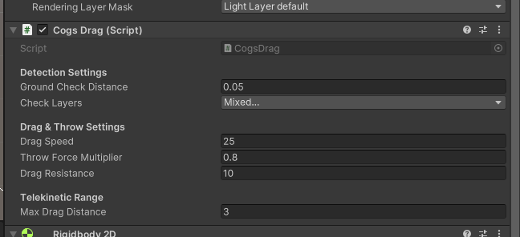

| Variable | Use Case |
|---|---|
| Ground Check Distance | How far the Cog checks the ground before stopping movement |
| Check Layers | Used so cogs don't get stuck mid-air. **All layers are checked except the Cogs Layer.** |
| Throw Force Multiplier | Controls the force when yeeting the cogs |
| Drag Resistance | How resistant the cog is when being dragged |
| Drag Speed | How fast the cog follows the dragging cursor |
| Max Drag Distance | How far the cog can travel before losing its telekinetic drag, based on the distance between the cog and the player |

**Cogs script** is attached to each individual cog to categorize it as Small, Medium, or Big.

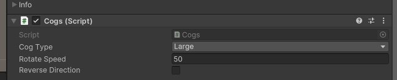

| Variable | Use Case |
|---|---|
| Cog Type | Identifies the cog's category (Small, Medium, Big) |
| Rotate Speed | How fast the cog rotates |
| Reverse Direction | Reverses the cog's rotation direction |

---

### Socket / Snapper `Prefabs/Environment/Socket`

A **Socket** is a slot where cogs can be attached — either as an environment socket or a socket on the player. Each socket can only accept specific cog types. When a cog is successfully attached, a signal is sent.

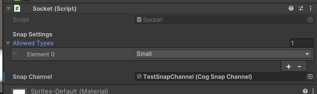

#### Player Socket

The Player Socket works the same as a regular socket but includes VFX settings and a cog-recalling mechanic.

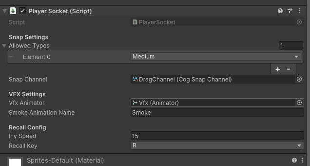

| Variable | Use Case |
|---|---|
| Fly Speed | How fast the cog flies back when recalled |
| Recall Key | The key used to recall attached cogs |

---

### Cog Snap Channels

A **CogSnapChannel** is a channel used to send a signal about a socketing event. It is essentially an empty object, but it **must be assigned to the Snap Channel field in the Socket editor**. Any Triggerable Object using the same channel will trigger its effect when the cog is snapped.

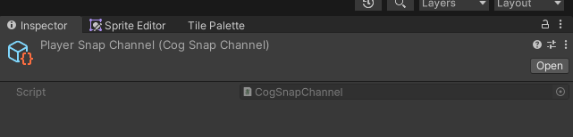

---

### Triggers

**Triggers** (or Triggerable Objects) implement the `ISocketAttached` interface. To activate a trigger, assign it the same channel as its corresponding Socket. Each trigger contains custom logic defined in its script.

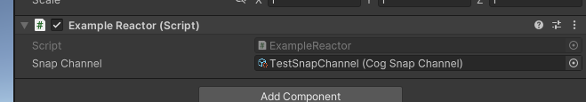

`ExampleReactor` demonstrates how a trigger should work. To create a new trigger:

1. Copy the `ExampleReactor` script.
2. **Rename the class.**
3. **Edit `OnCogAttached()` and `OnCogDetached()`** with your custom logic.

Currently the example uses debug logs, but it can be extended to do far more.

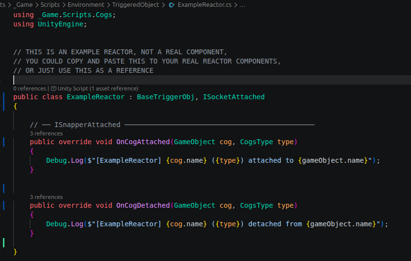

For a more advanced example, refer to [`PlayerSocketBuffTest.cs`](PlayerSocketBuffTest.cs).

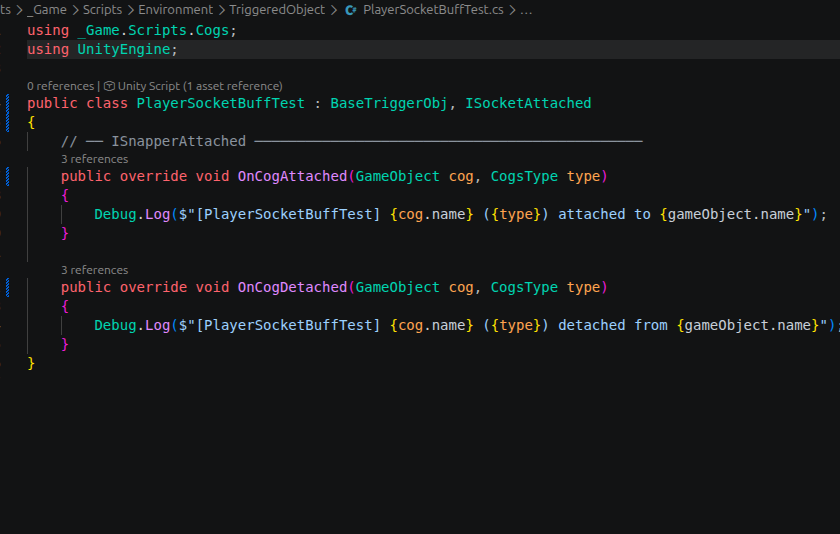

---

## B. Player

### Player Move

**PlayerMove** handles the character's horizontal traversal and ground-based visual effects. Movement is enabled when the required cog is attached to its corresponding socket.

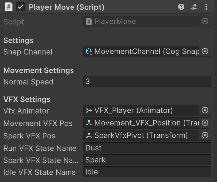

| Variable | Use Case |
|---|---|
| Snap Channel | Defines which socket connection unlocks movement |
| Normal Speed | Horizontal travel speed of the player |
| VFX Animator | References the Animator component for movement-related VFX |
| Movement VFX Pos | Transform position where general movement dust/particles are spawned |
| Spark VFX Pos | Transform pivot position for spark visual effects |
| Run VFX State Name | Exact string name of the running VFX animation state |
| Spark VFX State Name | Exact string name of the sparking VFX animation state |
| Idle VFX State Name | Exact string name of the idle VFX animation state |

---

### Player Jump

**PlayerJump** manages the character's vertical movement and mid-air physics. Jumping is enabled when the required cog is attached to its corresponding socket.

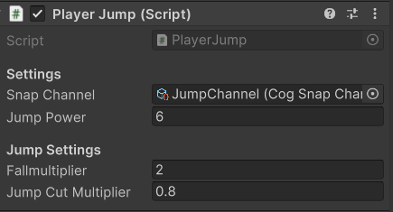

| Variable | Use Case |
|---|---|
| Snap Channel | Defines which socket connection unlocks jumping |
| Jump Power | Initial upward force applied when a jump is initiated |
| Fall Multiplier | Increases downward gravity while falling, making landings feel snappy and less floaty |
| Jump Cut Multiplier | Reduces upward velocity when jump input is released early, enabling variable jump heights |

---

### Player Telekinetic

**PlayerTelekinetic** grants the character the ability to manipulate or drag Cogs from a distance. This ability is enabled when the required cog is attached to its corresponding socket.

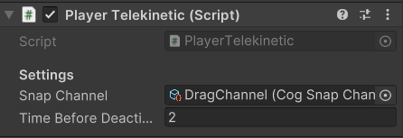

| Variable | Use Case |
|---|---|
| Snap Channel | Defines which socket connection unlocks the telekinetic ability |
| Time Before Deactivate | Duration (in seconds) the telekinetic effect remains active before automatically shutting off |

---

## C. Triggerable Objects

### Joint

**Joints** are interactable entities that rotate from an initial angle to a target angle when the required cog is attached to their corresponding socket.

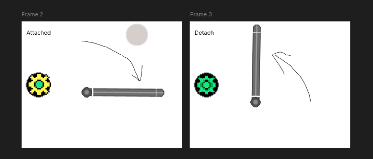
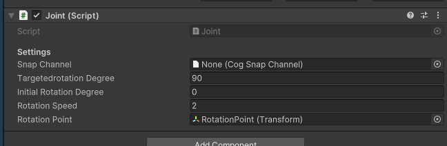

| Variable | Use Case |
|---|---|
| Snap Channel | Defines which socket connection triggers the joint's action |
| Targeted Rotation Degree | End rotation angle of the joint |
| Initial Rotation Degree | Starting position of the joint |
| Rotation Speed | Speed at which the joint rotates from initial to target angle |
| Rotation Point | Defines the pivot position of the joint |

---

### Gate

**Gates** are interactable triggerable entities that act as barriers for the player. They are activated when the required cog is attached to their socket.

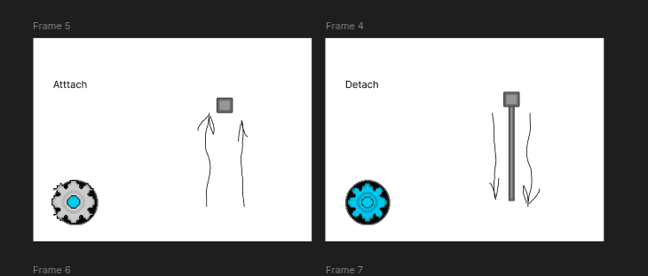
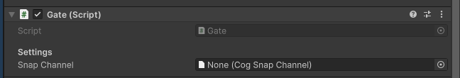

| Variable | Use Case |
|---|---|
| Snap Channel | Defines which socket connection triggers the gate's action |

---

### Elevator

**Elevators** are interactable entities that transport the player from one point to another when the required cog is attached to their corresponding socket.

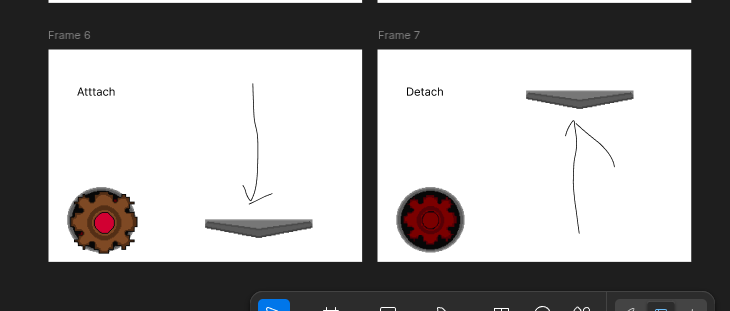
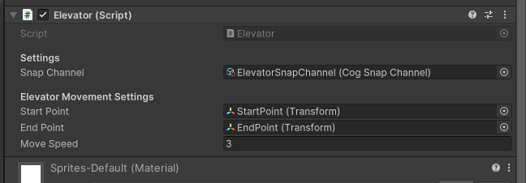

| Variable | Use Case |
|---|---|
| Snap Channel | Defines which socket connection triggers the elevator's action |
| Start Point | Initial position of the elevator |
| End Point | Target destination of the elevator |
| Move Speed | Speed at which the elevator moves |

---

## D. Hazard Area

**HazardArea** creates traps that can instantly kill or continuously damage a player. It requires a **Collider2D** component with **Is Trigger** set to `true`.

- Set **Is Instant Death** to `true` to create a one-hit-kill trap.
- Set **Is Instant Death** to `false` to create a damage-over-time zone.

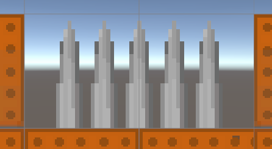
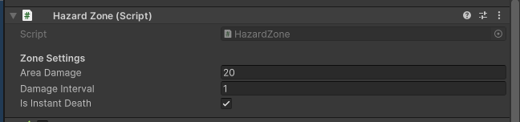

| Variable | Use Case |
|---|---|
| Area Damage | Damage the player receives while inside the hazard zone |
| Damage Interval | How often (in seconds) the player takes damage |
| Is Instant Death | When enabled, the hazard kills the player in a single hit |

---

*Documentation by Slafurry Studios*
